# Mechanizm różnicowy
Projekt mechanizmu różnicowego w programie Inventor.

# Części
Mechanizm składa się z:

- Głównego wału
  
  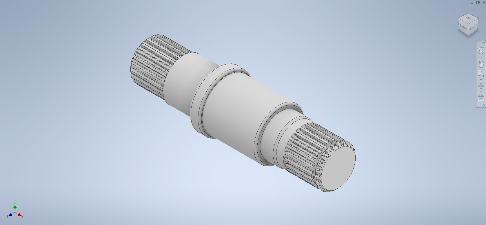
  
  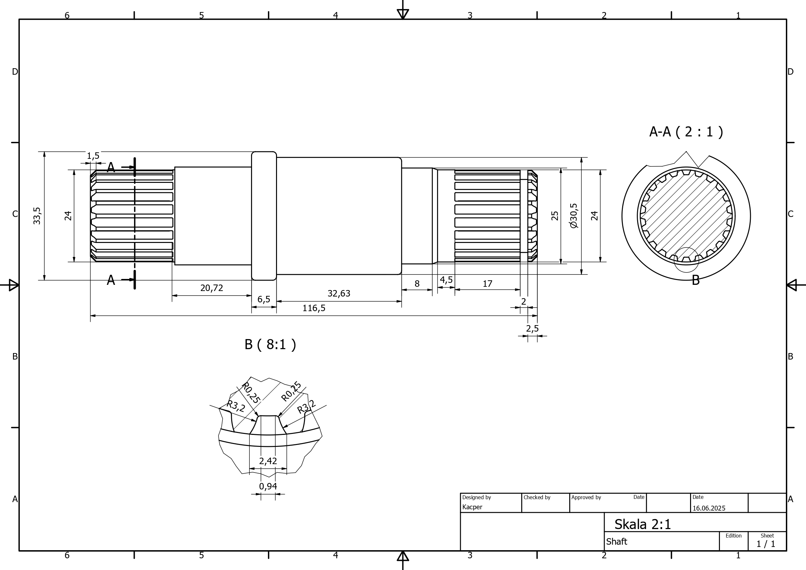

- Mocowania wału

  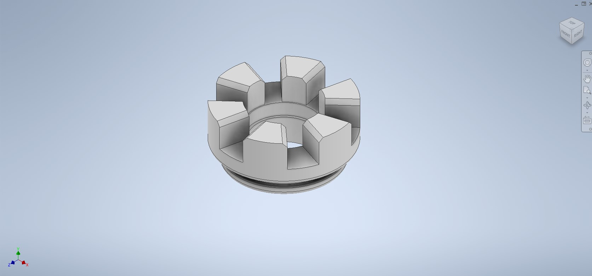

- Dwóch kół zębatych znajdujących się w osi wału

  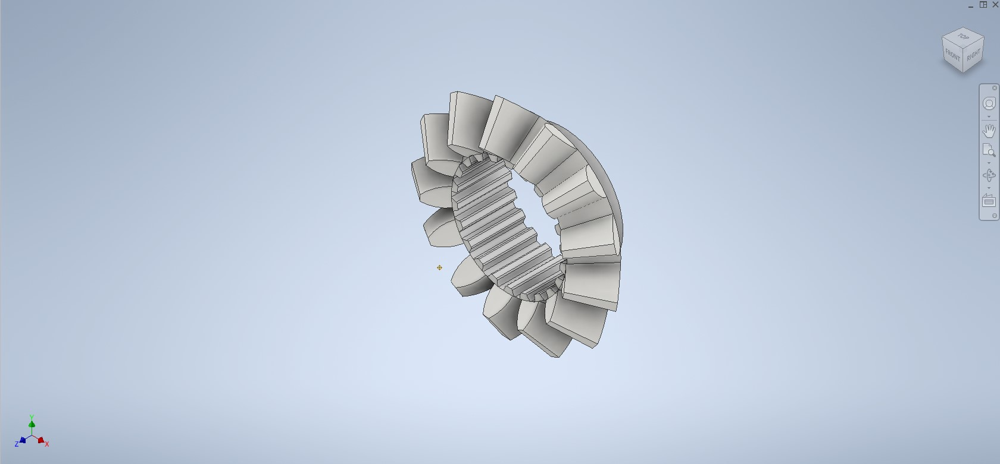

  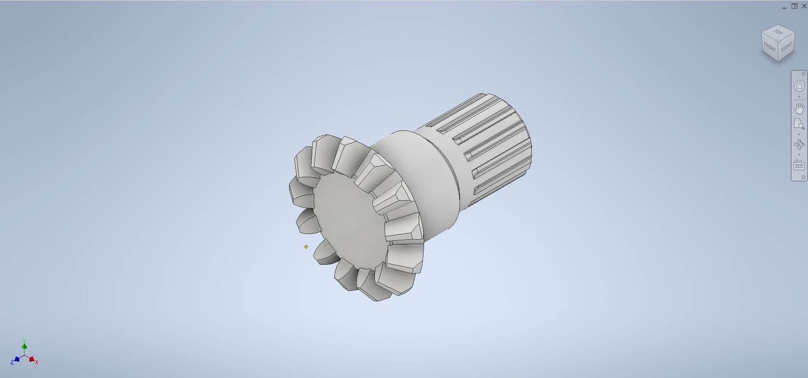

- Dwóch kół zębantych prostopadłych do wału

  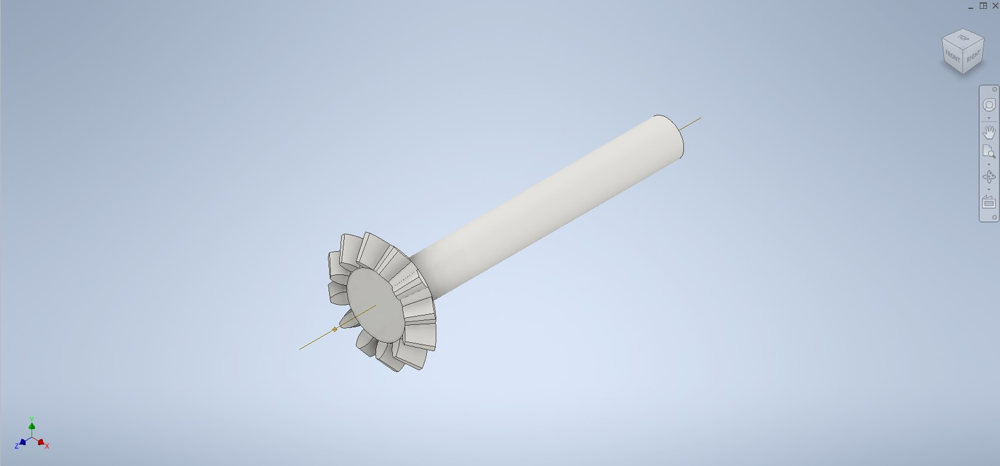

- Przedniej obudowy

  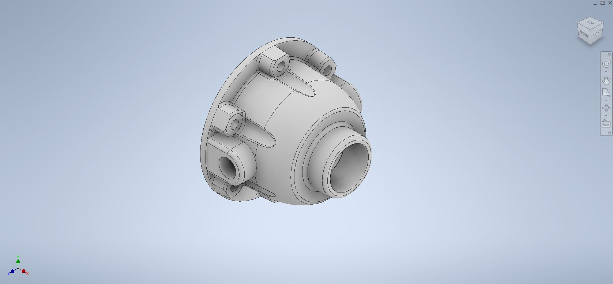

- Tylniej obudowy

  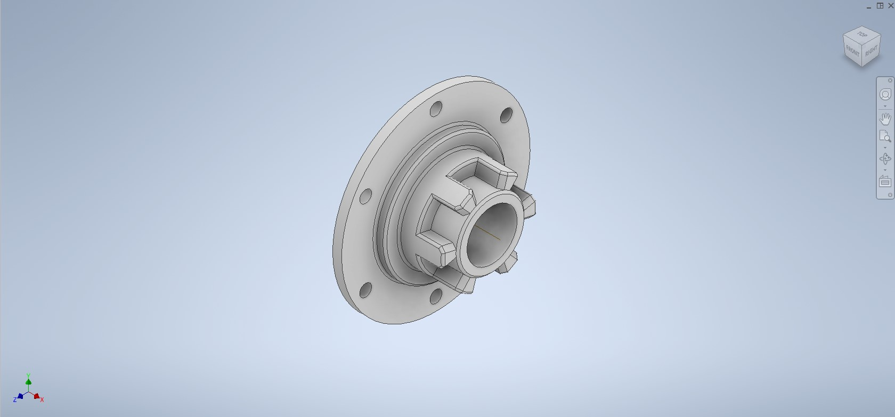

  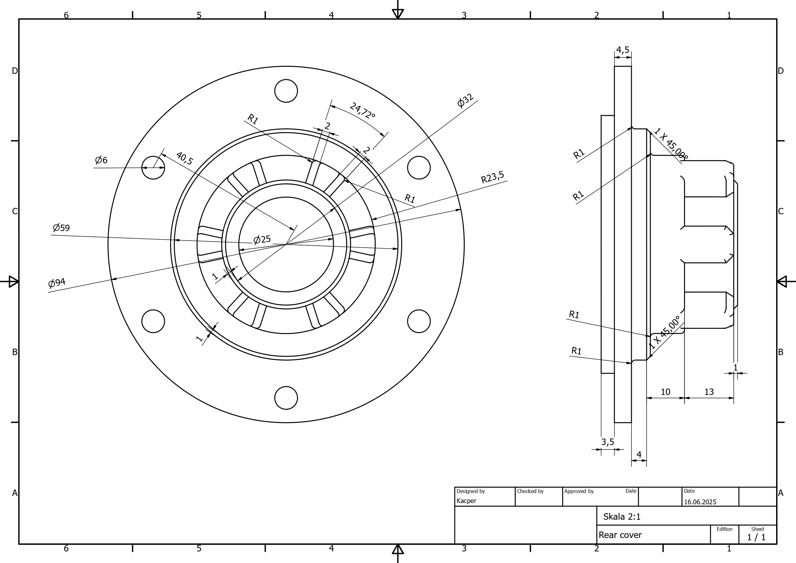

# Złożenie
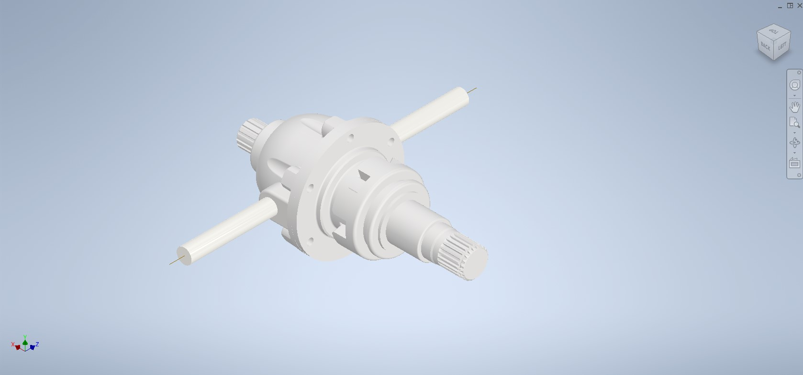

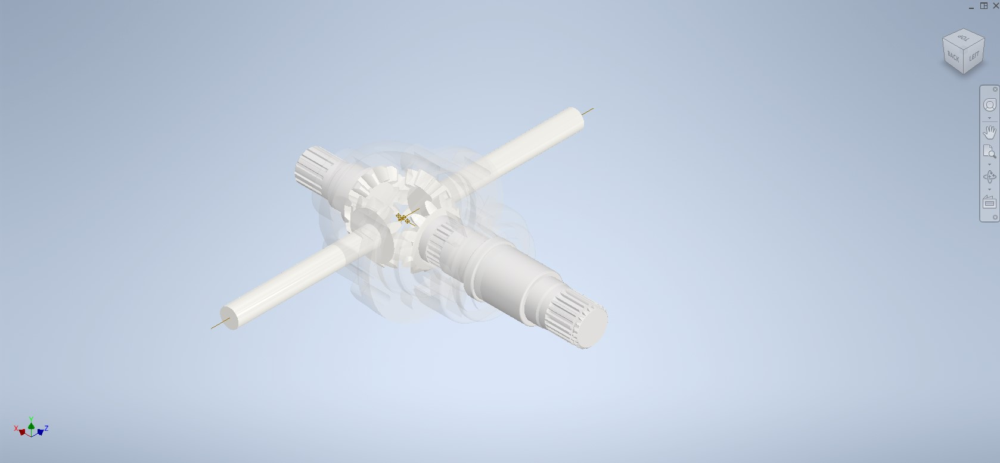

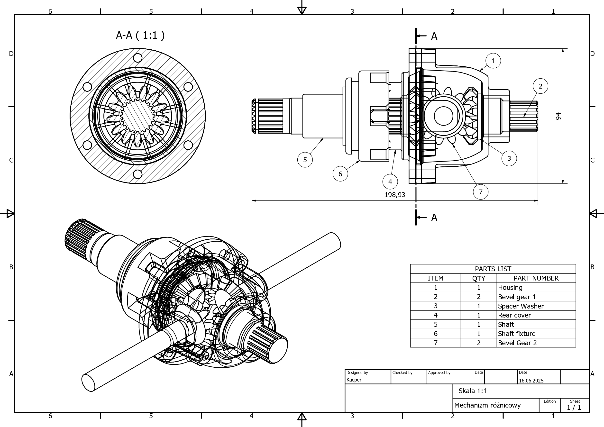

